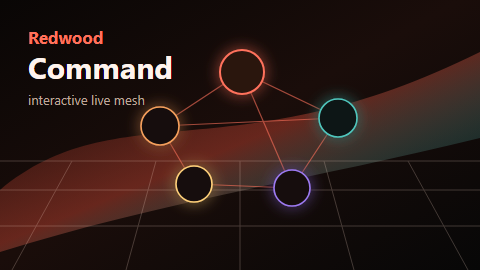

# Oracle Redwood Command

Interactive Lively Wallpaper web project.

## Preview

## Usage

- Click or drag the canvas nodes to select and reposition them.
- Use the bottom strip to switch selected layers.
- Use the right rail to change visual mode.
- Lively properties can adjust animation speed, mesh density, glow, palette, audio reaction, and HUD visibility.

This wallpaper is Oracle-themed through Redwood-style color and cloud/data motifs. It does not include a recreated Oracle logo.
